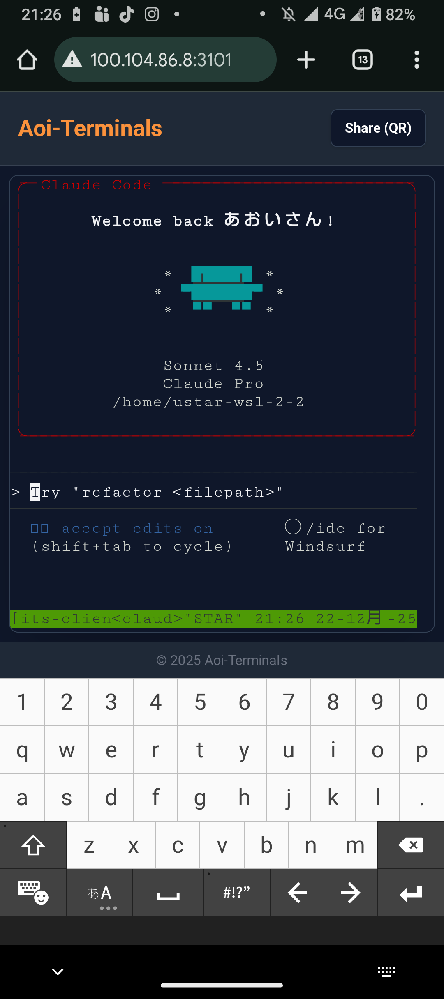

<div align="center">

# Aoi-Terminals

**Androidスマホ・タブレットからでも「普段のターミナル」をそのまま扱える、Webベースのリモートターミナル**

[![Next.js][Next-shield]][Next-url]
[![React][React-shield]][React-url]
[![TypeScript][TypeScript-shield]][TypeScript-url]
[![Node.js][Node-shield]][Node-url]
[![Docker][Docker-shield]][Docker-url]
[![GitHub Actions][Actions-shield]][Actions-url]
[![License][License-shield]][License-url]

[デモを見る](#デモ) · [バグ報告](https://github.com/takamiya1021/app045-aoi-terminal-system/issues) · [機能リクエスト](https://github.com/takamiya1021/app045-aoi-terminal-system/issues)

</div>

---

## 📑 目次

- [概要](#概要)
  - [スクリーンショット](#スクリーンショット)
  - [主な機能](#主な機能)
  - [技術スタック](#技術スタック)
- [はじめに](#はじめに)
  - [前提条件](#前提条件)
  - [インストール](#インストール)
    - [最短起動（推奨）](#最短起動推奨)
    - [Docker Composeで起動](#docker-composeで起動)
    - [開発環境で起動](#開発環境で起動)
- [使い方](#使い方)
- [ライセンス](#ライセンス)
- [コンタクト](#コンタクト)
- [謝辞](#謝辞)

---

## 概要

Aoi-Terminalsは、Androidスマホ・タブレットから快適にターミナル操作ができるWebベースのリモートターミナルシステムです。Tailscaleなどのプライベートネットワーク越しに、ワンタイム共有リンク（QR）で安全に接続できます。

**なぜAoi-Terminalsが必要か？**

- 🚀 **モバイルファースト設計**: 従来のターミナルはPCでの利用を前提としており、スマホ・タブレットでは操作が困難でした
- 🔒 **セキュア共有**: ワンタイムQRコードで一時的なアクセスを安全に提供
- 🎯 **日本語IME完全対応**: モバイルでの日本語入力が快適に動作
- 📱 **PWA対応**: インストール可能で、アプリライクな体験を提供

<p align="right">(<a href="#目次">トップへ戻る</a>)</p>

### スクリーンショット

<div align="center">
  <table>
    <tr>
      <td width="45%" align="center">
        
        <p align="center"><em>Androidスマホからターミナルにアクセスしている様子</em></p>
      </td>
      <td width="10%"></td>
      <td width="45%" align="center">
        
        <p align="center"><em>ターミナル操作とtmuxコントロールの様子</em></p>
      </td>
    </tr>
  </table>
</div>

<p align="right">(<a href="#目次">トップへ戻る</a>)</p>

### 主な機能

- 📱 **モバイル快適**: 日本語IMEに強く、Androidでも入力しやすい設計
- 🧩 **tmux操作UI**: 分割・切替などをボタンで操作（タッチ前提でも迷いにくい）
- 🔗 **ワンタイムQRログイン**:
  - 起動時やシェア時に表示されるQRコードは、すべて**5分間有効なワンタイムリンク**です
  - セキュリティのため、一度使用するか5分経過すると無効になります
- 🧷 **セッション期間の違い**:
  - **自分用ログイン**: 24時間有効（スクリプトから発行）
  - **シェア用リンク**: 6時間有効（画面のShareボタンから発行）
- 🧼 **シンプル起動**: ローカル開発 / Dockerのどちらでも起動可能
- 🔐 **セキュア認証**: ランダムトークン自動生成、HTTPSでのCookie Secure対応
- 🎨 **モダンUI**: Claude Code on the Web風のクリーンなデザイン
- 📺 **全画面モード**: ボタン一発でブラウザの枠を消して没入感のある操作が可能

<p align="right">(<a href="#目次">トップへ戻る</a>)</p>

### 技術スタック

このプロジェクトは、以下の技術を使用して構築されています：

#### フロントエンド
* [![Next.js][Next-shield]][Next-url] - React フレームワーク（v14 App Router）
* [![React][React-shield]][React-url] - UI ライブラリ
* [![TypeScript][TypeScript-shield]][TypeScript-url] - 型安全な開発
* [![Tailwind CSS][Tailwind-shield]][Tailwind-url] - ユーティリティファーストCSS
* [![xterm.js][xterm-shield]][xterm-url] - ターミナルエミュレータ
* [![PWA][PWA-shield]][PWA-url] - next-pwa（Service Worker、オフライン対応）

#### バックエンド
* [![Node.js][Node-shield]][Node-url] - JavaScript ランタイム
* [![Express][Express-shield]][Express-url] - Webフレームワーク
* [![WebSocket][WebSocket-shield]][WebSocket-url] - リアルタイム双方向通信
* [![node-pty][node-pty-shield]][node-pty-url] - PTY（仮想端末）管理

#### インフラ・ツール
* [![Docker][Docker-shield]][Docker-url] - コンテナ化
* [![GitHub Actions][Actions-shield]][Actions-url] - CI/CD（GHCR自動publish）
* [![tmux][tmux-shield]][tmux-url] - ターミナルマルチプレクサ

<p align="right">(<a href="#目次">トップへ戻る</a>)</p>

---

## はじめに

Aoi-Terminalsをローカル環境で実行するための手順を説明します。

### 前提条件

以下のソフトウェアがインストールされている必要があります：

#### Docker使用（推奨）
* [Docker Desktop for Windows](https://www.docker.com/products/docker-desktop/) をインストール
  ```sh
  # 確認コマンド（WSLターミナルで実行）
  docker --version
  docker compose version
  ```

#### Dockerを使用しない場合
* Node.js 20以上
  ```sh
  # Node.jsバージョン確認
  node --version  # v20.0.0以上
  ```
* npm
  ```sh
  npm install npm@latest -g
  ```
* tmux
  ```sh
  # WSL/Ubuntuの場合
  sudo apt-get install tmux
  ```

<p align="right">(<a href="#目次">トップへ戻る</a>)</p>

## インストール

目的に合わせて、3つのインストール方法から選んでな。

| 方法 | 対象 | 特徴 |
| :--- | :--- | :--- |
| **1. 最短起動 (GHCR)** | **一般ユーザー** | 1コマンドで完了。ビルド不要で一番楽。 |
| **2. Docker Compose** | **カスタマイズしたい人** | ソースを落として自分でビルド。設定変更も自由。 |
| **3. マニュアル (開発)** | **開発者** | WSL/Linux上でNode.jsを直接動かす。開発用。 |

---

### パス1：最短起動（推奨）
GitHub Container Registry（GHCR）にあるビルド済みイメージを使って、1コマンドで全自動セットアップするで。

**前提条件**:
- Docker Desktop for Windowsが起動していること

```bash
curl -fsSL https://raw.githubusercontent.com/takamiya1021/app045-aoi-terminal-system/main/scripts/install-docker.sh \
  | bash
```

> [!TIP]
> **自動で行われること**:
> - Dockerイメージのダウンロード
> - ログイントークンの自動生成（`~/.aoi-terminals/.env`）
> - コンテナの起動 & 共有用QRコードの表示

> [!NOTE]
> **更新したい時**:
> 後日、最新版に更新したい場合は、同じコマンドを再実行するだけでOK。
> 最新イメージの自動ダウンロード＋コンテナ再作成が行われます。

---

### パス2：Docker Composeで起動
リポジトリをクローンして、手元でビルド・実行する方法や。

1. **リポジトリをクローン**
   ```sh
   git clone https://github.com/takamiya1021/app045-aoi-terminal-system.git
   cd app045-aoi-terminal-system
   ```

2. **環境設定**
   ```sh
   cp .env.docker.example .env
   # 必要に応じて .env を編集
   ```

3. **ビルド & 起動**
   ```sh
   docker compose up -d --build
   ```

---

### パス3：開発環境（マニュアル）で起動
WSL/Linux環境で、Node.jsを直接叩いて開発・テストする場合や。

1. **前提条件**: Node.js 20+, npm, tmuxをインストールしておいてな。
2. **セットアップ**
   ```sh
   npm run setup
   ```
3. **起動**
   ```sh
   ./scripts/start.sh
   ```

**停止**: `./scripts/stop.sh` で止まるわ。

<p align="right">(<a href="#目次">トップへ戻る</a>)</p>

---

## 使い方（推奨：最短起動パスの場合）

このセクションでは、**「パス1：最短起動 (GHCR)」**でインストールした後の、標準的な運用手順を説明します。

> [!NOTE]
> Aoi-Terminalsは、**「Windows/WSLの環境を、外出先のAndroidスマホやタブレットから安全に操作する」**ことを主眼に設計されています。

### 前提となる環境
- **Windows**: [Docker Desktop for Windows](https://www.docker.com/products/docker-desktop/) が動作していること。
- **VPN**: Windowsとモバイル端末の両方に [Tailscale](https://tailscale.com/) が導入され、VPN接続されていること。

### 基本的な使用手順

1. **コンテナの起動**
   - Windows側の **Docker Desktop** を開き、`aoi-terminals` コンテナを「Start」させます。
   - （※インストール直後は自動で起動しています）

2. **ログイン用QRコードの表示**
   - WSL（Ubuntu等）のターミナルを開き、以下のコマンドを実行します。
     ```bash
     ~/.aoi-terminals/print-share-qr.sh
     ```
   - 画面に**5分間有効なログイン用QRコード**が表示されます。

3. **モバイルからの接続・認証**
   - モバイル端末のカメラでQRコードを読み取り、ブラウザで開きます。
   - 自動でログインが完了し、いつものターミナル環境に繋がります。
   - **セッション**: 一度ログインすれば24時間有効です。

4. **共有と操作**
   - **共有**: 画面上の `Share (QR)` ボタンから、一時的な共有用QRを発行できます（6時間有効）。
   - **操作**: tmuxパネルを展開して、ウィンドウの作成や切り替えを指先で操作できます。

---

### 環境設定（Tailscale経由で繋がらない場合）

TailscaleのIPでアクセスできるように、`.env` ファイル（`~/.aoi-terminals/.env`）の `ALLOWED_ORIGINS` にTailscaleのIPアドレスが含まれているか確認してください。
`install-docker.sh` を使用した場合、Tailscaleが有効であれば自動的に設定されます。

4. **tmux操作**
   - tmuxパネルを展開して、ウィンドウ分割・切替などをボタンで操作

### 認証とセッションの仕組み

セキュアな運用のために、トークンの種類によって有効期限が異なります。

| トークン体系 | 再利用 | セッション有効期間 | 用途 |
| :--- | :--- | :--- | :--- |
| **オーナー用** (`TERMINAL_TOKEN`) | **可能** | **24時間** | 自分用のメインアクセス。起動時のQRや環境変数で使用。 |
| **シェア用** | **不可 (1回限り)** | **6時間** | 他端末や他人への一時的な共有用。一度使うと無効化。 |

- **セッションの維持**: ブラウザを閉じても、クッキーが有効なら24時間以内（シェアは6時間）は再アクセス可能です。
- **リンクの有効期限**: QRコードやURLに含まれるトークン自体の有効期限は**5分間**です（その間にアクセスしてクッキーを確立する必要があります）。

### 環境設定

主要な環境変数（`.env`ファイルで設定）:

| 変数名 | 説明 | デフォルト値 |
|--------|------|-------------|
| `TERMINAL_TOKEN` | ログイン用トークン | 自動生成 |
| `ALLOWED_ORIGINS` | 許可するOrigin（CORS） | `http://localhost:3101` |
| `TERMINAL_LINK_TOKEN_TTL_SECONDS` | 共有リンクの有効期限（秒） | `300` (5分) |
| `TERMINAL_COOKIE_SECURE` | Cookie Secure属性 | `0` (HTTP時) |

**Tailscale/LAN経由でアクセスする場合**:
```env
ALLOWED_ORIGINS=http://your-tailscale-hostname:3101,http://your-ip:3101
```

詳細なドキュメントは [doc/](doc/) ディレクトリを参照してください。

<p align="right">(<a href="#目次">トップへ戻る</a>)</p>

---

## ライセンス

TBD

<!-- ライセンスが決定次第、以下のような形式で記載してください
Distributed under the MIT License. See `LICENSE` for more information.
-->

<p align="right">(<a href="#目次">トップへ戻る</a>)</p>

---

## コンタクト

あおいさん - [@takamiya1021](https://github.com/takamiya1021)

プロジェクトリンク: [https://github.com/takamiya1021/app045-aoi-terminal-system](https://github.com/takamiya1021/app045-aoi-terminal-system)

<p align="right">(<a href="#目次">トップへ戻る</a>)</p>

---

## 謝辞

このプロジェクトの開発にあたり、以下のリソースとツールに感謝します：

* [xterm.js](https://xtermjs.org/) - 強力なターミナルエミュレータ
* [node-pty](https://github.com/microsoft/node-pty) - PTY実装
* [Next.js](https://nextjs.org/) - Reactフレームワーク
* [Tailwind CSS](https://tailwindcss.com/) - CSSフレームワーク
* [tmux](https://github.com/tmux/tmux) - ターミナルマルチプレクサ
* [Claude Code on the Web](https://claude.ai) - UIデザインのインスピレーション
* [Best-README-Template](https://github.com/othneildrew/Best-README-Template) - READMEテンプレート

**特別な謝辞**:
* じぇみ（Gemini CLI） - 創発的アイデアと実装のリード
* クロ（Claude CLI） - 堅実な実装と全体設計のサポート
* チャッピー（Codex CLI） - 精密な技術分析とデバッグのサポート

<p align="right">(<a href="#目次">トップへ戻る</a>)</p>

---

<!-- MARKDOWN LINKS & IMAGES -->
[Next-shield]: https://img.shields.io/badge/Next.js-14-black?style=for-the-badge&logo=next.js&logoColor=white
[Next-url]: https://nextjs.org/
[React-shield]: https://img.shields.io/badge/React-18-61DAFB?style=for-the-badge&logo=react&logoColor=black
[React-url]: https://reactjs.org/
[TypeScript-shield]: https://img.shields.io/badge/TypeScript-5-3178C6?style=for-the-badge&logo=typescript&logoColor=white
[TypeScript-url]: https://www.typescriptlang.org/
[Node-shield]: https://img.shields.io/badge/Node.js-20+-339933?style=for-the-badge&logo=node.js&logoColor=white
[Node-url]: https://nodejs.org/
[Docker-shield]: https://img.shields.io/badge/Docker-Ready-2496ED?style=for-the-badge&logo=docker&logoColor=white
[Docker-url]: https://www.docker.com/
[Actions-shield]: https://img.shields.io/github/actions/workflow/status/takamiya1021/app045-aoi-terminal-system/publish-ghcr.yml?style=for-the-badge&logo=github-actions&logoColor=white
[Actions-url]: https://github.com/takamiya1021/app045-aoi-terminal-system/actions
[License-shield]: https://img.shields.io/badge/License-TBD-lightgrey?style=for-the-badge
[License-url]: #ライセンス
[Tailwind-shield]: https://img.shields.io/badge/Tailwind_CSS-3-38B2AC?style=for-the-badge&logo=tailwind-css&logoColor=white
[Tailwind-url]: https://tailwindcss.com/
[xterm-shield]: https://img.shields.io/badge/xterm.js-5.5-000000?style=for-the-badge
[xterm-url]: https://xtermjs.org/
[PWA-shield]: https://img.shields.io/badge/PWA-Enabled-5A0FC8?style=for-the-badge&logo=pwa&logoColor=white
[PWA-url]: https://web.dev/progressive-web-apps/
[Express-shield]: https://img.shields.io/badge/Express-5-000000?style=for-the-badge&logo=express&logoColor=white
[Express-url]: https://expressjs.com/
[WebSocket-shield]: https://img.shields.io/badge/WebSocket-Ready-010101?style=for-the-badge
[WebSocket-url]: https://developer.mozilla.org/en-US/docs/Web/API/WebSockets_API
[node-pty-shield]: https://img.shields.io/badge/node--pty-1.0-339933?style=for-the-badge
[node-pty-url]: https://github.com/microsoft/node-pty
[tmux-shield]: https://img.shields.io/badge/tmux-Integrated-1BB91F?style=for-the-badge
[tmux-url]: https://github.com/tmux/tmux
