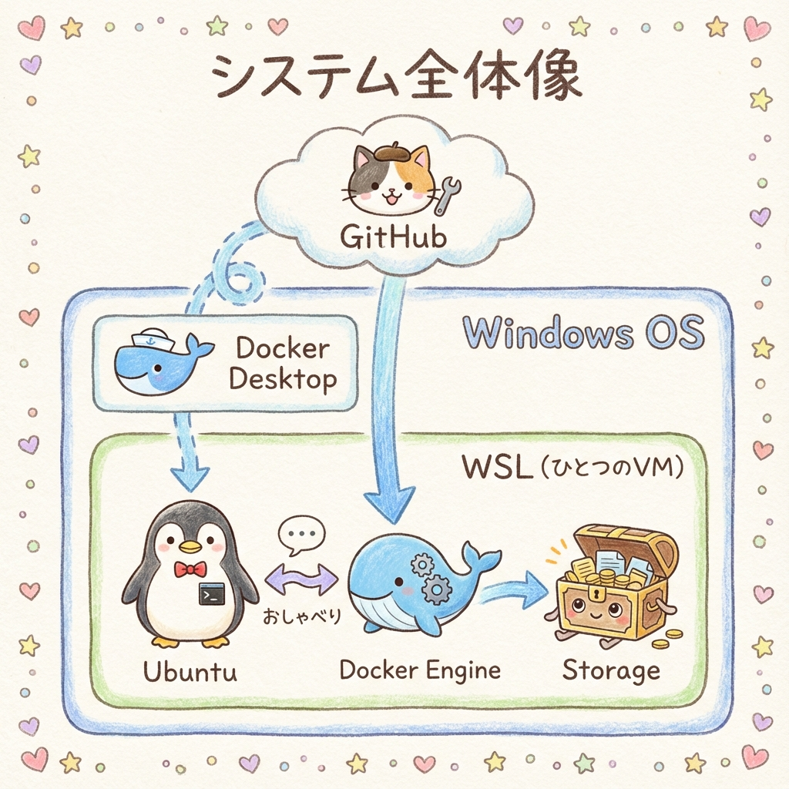
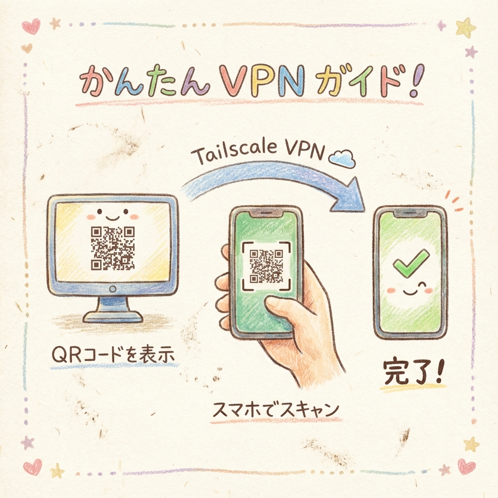

<div align="center">

# Aoi-Terminals

**Androidスマホ・タブレットからでも「普段のターミナル」をそのまま扱える、Webベースのリモートターミナル**

[![Next.js][Next-shield]][Next-url]
[![React][React-shield]][React-url]
[![TypeScript][TypeScript-shield]][TypeScript-url]
[![Node.js][Node-shield]][Node-url]
[![Docker][Docker-shield]][Docker-url]
[![GitHub Actions][Actions-shield]][Actions-url]
[![License][License-shield]][License-url]

[バグ報告](https://github.com/takamiya1021/app045-aoi-terminal-system/issues) · [機能リクエスト](https://github.com/takamiya1021/app045-aoi-terminal-system/issues)

</div>

---

## 📑 目次

- [概要](#概要)
  - [主な機能](#主な機能)
- [📋 共通の前提条件](#-共通の前提条件)
  - [必須要件](#必須要件)
  - [WSL2環境での注意事項（Ubuntu 24.04以降）](#wsl2環境での注意事項ubuntu-2404以降)
- [🚀 本番環境（プロダクション・運用）](#-本番環境プロダクション運用)
  - [1. 最短起動（GHCR・推奨）](#1-最短起動ghcr推奨)
  - [2. 使い方・運用手順](#2-使い方運用手順)
- [🛠️ 開発環境（デバッグ・カスタマイズ）](#️-開発環境デバッグカスタマイズ)
  - [追加の前提条件](#追加の前提条件)
  - [セットアップと起動](#セットアップと起動)
- [詳細仕様](#詳細仕様)
  - [認証・セッション](#認証セッション)
  - [環境設定](#環境設定)
- [既知の制限](#既知の制限)
- [謝辞](#謝辞)

---

## 概要

Aoi-Terminalsは、Androidスマホ・タブレットから快適にターミナル操作ができるWebベースのリモートターミナルシステムです。Tailscaleなどのプライベートネットワーク越しに、ワンタイム共有リンク（QR）で安全に接続できます。

### スクリーンショット

<div align="center">
  <table>
    <tr>
      <td width="50%">
        
        <p align="center"><em>Androidスマホからターミナルにアクセスしている様子</em></p>
      </td>
      <td width="50%">
        
        <p align="center"><em>ターミナル操作とtmuxコントロールの様子</em></p>
      </td>
    </tr>
  </table>
</div>

### システム全体像

<div align="center">
  
  <p><em>GitHub・Docker Desktop・WSL・Ubuntuの連携イメージ</em></p>
</div>

### 主な機能

- 📱 **モバイル最適**: 日本語IMEに強く、Androidでも入力しやすい設計
- 🧩 **tmux操作UI**: 分割・切替などをボタンで操作（タッチ前提でも迷いにくい）
- 🔗 **ワンタイムQRログイン**: セキュリティのため、リンクは5分間のみ有効
- 🔐 **セキュア認証**: ランダムトークン自動生成、HTTPSでのCookie Secure対応
- 🎨 **モダンUI**: Claude Code on the Web風のクリーンなデザイン
- 📺 **全画面モード**: ボタン一発で没入感のある操作が可能

<p align="right">(<a href="#目次">トップへ戻る</a>)</p>

---

## 📋 共通の前提条件

本番環境・開発環境どちらでも必要な共通の要件です。

### 必須要件

1. **WSL2 + Ubuntu 24.04以降**: 本システムはWSL2上のUbuntu 24.04以降（systemd環境）を前提としています
2. **Docker**: [Docker Desktop for Windows](https://www.docker.com/products/docker-desktop/) または WSL上のDockerが動作していること
3. **一般ユーザー**: `root` ではなく、標準の一般ユーザーで実行すること
4. **SSHサーバー**: WSL環境では `openssh-server` が必要です
   ```bash
   sudo apt update && sudo apt install -y openssh-server
   sudo service ssh start
   ```

### WSL2環境での注意事項（Ubuntu 24.04以降）

Ubuntu 24.04以降では、systemdがデフォルトで有効化されており、`systemd-binfmt`サービスがWSL Interop（WindowsコマンドをWSLから実行する機能）を無効化してしまう場合があります。

**症状**：
- `notepad.exe`や`explorer.exe`などのWindowsコマンドが実行できない
- Docker Desktopとの連携に問題が発生する

**恒久的な対策**：
```bash
# WSL Interopを保護する設定ファイルを作成
sudo mkdir -p /etc/binfmt.d
echo ':WSLInterop:M::MZ::/init:PF' | sudo tee /etc/binfmt.d/WSLInterop.conf
```

この設定により、WSL再起動後も自動的にWSL Interopが有効化されます。

**確認方法**：
```bash
# WSL再起動後に実行
notepad.exe
# メモ帳が起動すればOK
```

### 複数のWSLディストリビューションを使用する場合

同じWindows上で複数のWSLディストリビューション（例：Ubuntu-22.04とUbuntu-24.04）を使用している場合、**ポートが競合する**ことがあります。

**競合するポート**：
- `22` (SSH)
- `3101` (フロントエンド)
- `3102` (バックエンド)

**症状**：
- SSHサーバーが起動できない（`Address already in use`）
- aoi-terminalsの起動時にポートエラー

**対策**：
aoi-terminalsを使用するディストリビューション以外では、該当サービスを停止してください：
```bash
# 他のディストリビューションで実行
sudo systemctl stop ssh.socket ssh.service  # SSHを停止
~/.aoi-terminals/aoi-terminals stop          # aoi-terminalsを停止
```

<p align="right">(<a href="#目次">トップへ戻る</a>)</p>

---

## 🚀 本番環境（プロダクション・運用）

一般ユーザーの方や、安定して運用したい方向けの設定です。Dockerを使用します。

### 1. 最短起動（GHCR・推奨）

ビルド不要で、1コマンドで全自動セットアップし、起動用CLIをご利用の環境へ導入します。

```bash
# インストーラーを実行 (インストールのみ完了します)
curl -L "https://raw.githubusercontent.com/takamiya1021/app045-aoi-terminal-system/main/scripts/install-docker.sh?v=$(date +%s)" | bash
```

> [!TIP]
> **更新方法**: 最新版に更新したい場合は、同じコマンドを再実行するだけでOKです。

### 2. 使い方・運用手順

<div align="center">
  
  <p><em>QRコードをスマホでスキャンするだけで接続完了！</em></p>
</div>

#### 起動と停止
- **`start`** (`up`): システムを起動し、ログイン用QRコードを表示します。
  ```bash
  ~/.aoi-terminals/aoi-terminals start
  ```
- **`stop`** (`down`): 全てのシステム（コンテナ）を停止します。
  ```bash
  ~/.aoi-terminals/aoi-terminals stop
  ```

#### QRコード再発行
QRコードは5分で期限切れ＆ワンタイムです。再ログインや別端末で接続したい時は再発行してください。
```bash
~/.aoi-terminals/aoi-terminals qr
```

#### 状態確認とメンテナンス
- **`info`**: 現在のシステム設定（ログインURL、マスターキー、インストール先）を表示します。
  ```bash
  ~/.aoi-terminals/aoi-terminals info
  ```
- **`logs`**: コンテナの実行ログを流し見します（終了は `Ctrl+C`）。
  ```bash
  ~/.aoi-terminals/aoi-terminals logs
  ```

#### アンインストール
完全に削除したい場合は、アンインストーラーを実行してください：
```bash
bash <(curl -fsSL "https://raw.githubusercontent.com/takamiya1021/app045-aoi-terminal-system/main/scripts/uninstall.sh")
```

削除されるもの：
- Dockerコンテナ（frontend/backend）→ サーバーも自動停止
- 設定ディレクトリ (`~/.aoi-terminals`)
- SSH authorized_keys から aoi-terminals-bridge 鍵
- Dockerイメージ（確認後オプション）

> [!NOTE]
> SSHサーバーは自動停止されません。不要な場合は手動で停止してください：
> ```bash
> sudo service ssh stop
> ```

<p align="right">(<a href="#目次">トップへ戻る</a>)</p>

---

## 🛠️ 開発環境（デバッグ・カスタマイズ）

本システムの開発や、直接Node.jsを叩いて挙動を確認したい方向けの設定です。

### 追加の前提条件

[共通の前提条件](#-共通の前提条件)に加えて、以下が必要です：

- **Node.js**: v20.0.0 以上
- **npm**: 最新版推奨
- **tmux**: インストール済みであること (`sudo apt install tmux`)
- **node-pty依存**: ビルド用に `python3`, `make`, `g++` が必要

### セットアップと起動

1. **リポジトリの準備**
   ```sh
   git clone https://github.com/takamiya1021/app045-aoi-terminal-system.git
   cd app045-aoi-terminal-system
   ```

2. **依存関係のインストールとビルド**
   ```sh
   npm run setup
   ```

3. **開発モードで起動**
   ```sh
   # バックエンド・フロントエンドをtmuxセッションで一括起動
   ./scripts/start.sh
   ```

4. **停止とログ確認**
   - **停止**: `./scripts/stop.sh`
   - **ログ**: `tmux attach -t terminal-system`

<p align="right">(<a href="#目次">トップへ戻る</a>)</p>

---

## 詳細仕様

### 認証・セッション

| トークン体系 | 再利用 | 有効期間 | 用途 |
| :--- | :--- | :--- | :--- |
| **オーナー用** | **可能** | **24時間** | 自分用のメインアクセス。 |
| **シェア用** | **不可** | **6時間** | 他人・他端末への一時的な共有用。 |

- **リンク有効期限**: QRコード/URL自体の寿命は **5分間** です。

### 環境設定

主要な環境変数（`.env`ファイル）:

| 変数名 | 説明 | デフォルト値 |
|--------|------|-------------|
| `TERMINAL_TOKEN` | ログイン用トークン | 自動生成 |
| `ALLOWED_ORIGINS` | 許可するOrigin | `http://localhost:3101` |
| `TERMINAL_SSH_TARGET` | ブリッジ先ホスト | (Docker時必須) |

<p align="right">(<a href="#目次">トップへ戻る</a>)</p>

---

## 既知の制限

### モバイルでのIME入力

モバイル端末でIME（日本語入力など）を使用する場合、入力開始時にカーソルが先頭位置に移動することがあります。これはxterm.jsライブラリの制約によるものです。

**対処方法**: Enterキーを2回押すことでコマンドが実行されます（1回目でカーソル位置が正常に戻り、2回目で実行）。

### WSL再起動後にdockerコマンドが見つからない

WSLを再起動（`wsl --shutdown`など）した後、`docker`コマンドが見つからないエラーが発生することがあります。これはDocker DesktopとWSLの統合が一時的に切断されるためです。

**対処方法**: Docker Desktop を再起動してください（タスクトレイのDockerアイコン → Restart）。

<p align="right">(<a href="#目次">トップへ戻る</a>)</p>

---

## 謝辞

* **じぇみ（Gemini CLI）** - 創発的アイデアと実装のリード
* **クロ（Claude CLI）** - 堅実な実装と全体設計のサポート
* **チャッピー（Codex CLI）** - 精密な技術分析とデバッグのサポート

---
あおいさん - [@takamiya1021](https://github.com/takamiya1021)

<!-- MARKDOWN LINKS & IMAGES -->
[Next-shield]: https://img.shields.io/badge/Next.js-14-black?style=for-the-badge&logo=next.js&logoColor=white
[Next-url]: https://nextjs.org/
[React-shield]: https://img.shields.io/badge/React-18-61DAFB?style=for-the-badge&logo=react&logoColor=black
[React-url]: https://reactjs.org/
[TypeScript-shield]: https://img.shields.io/badge/TypeScript-5-3178C6?style=for-the-badge&logo=typescript&logoColor=white
[TypeScript-url]: https://www.typescriptlang.org/
[Node-shield]: https://img.shields.io/badge/Node.js-20+-339933?style=for-the-badge&logo=node.js&logoColor=white
[Node-url]: https://nodejs.org/
[Docker-shield]: https://img.shields.io/badge/Docker-Ready-2496ED?style=for-the-badge&logo=docker&logoColor=white
[Docker-url]: https://www.docker.com/
[Actions-shield]: https://img.shields.io/github/actions/workflow/status/takamiya1021/app045-aoi-terminal-system/publish-ghcr.yml?style=for-the-badge&logo=github-actions&logoColor=white
[Actions-url]: https://github.com/takamiya1021/app045-aoi-terminal-system/actions
[License-shield]: https://img.shields.io/badge/License-MIT-green?style=for-the-badge
[License-url]: https://github.com/takamiya1021/app045-aoi-terminal-system/blob/main/LICENSE
[Tailwind-shield]: https://img.shields.io/badge/Tailwind_CSS-3-38B2AC?style=for-the-badge&logo=tailwind-css&logoColor=white
[Tailwind-url]: https://tailwindcss.com/
[xterm-shield]: https://img.shields.io/badge/xterm.js-5.5-000000?style=for-the-badge
[xterm-url]: https://xtermjs.org/
[PWA-shield]: https://img.shields.io/badge/PWA-Enabled-5A0FC8?style=for-the-badge&logo=pwa&logoColor=white
[PWA-url]: https://web.dev/progressive-web-apps/
[Express-shield]: https://img.shields.io/badge/Express-5-000000?style=for-the-badge&logo=express&logoColor=white
[Express-url]: https://expressjs.com/
[WebSocket-shield]: https://img.shields.io/badge/WebSocket-Ready-010101?style=for-the-badge
[WebSocket-url]: https://developer.mozilla.org/en-US/docs/Web/API/WebSockets_API
[node-pty-shield]: https://img.shields.io/badge/node--pty-1.0-339933?style=for-the-badge
[node-pty-url]: https://github.com/microsoft/node-pty
[tmux-shield]: https://img.shields.io/badge/tmux-Integrated-1BB91F?style=for-the-badge
[tmux-url]: https://github.com/tmux/tmux
