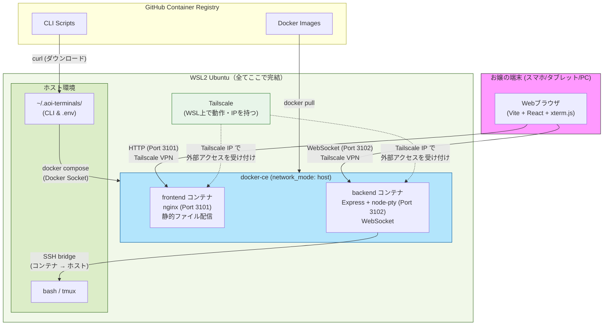

# Aoi-Terminals システム構造図（v2/v3）

## 1. 直感的なシステム配置図

### アーキテクチャ全体像とデータフロー

お嬢のシステムは、**WSL2の中で全てが完結する**構成になっとるで。Windows側に必要なソフトウェアは何もない。Docker DesktopもTailscaleアプリも不要や。WSLの中だけで、docker-ce・Tailscale・SSH・bashが全部動いとる。

```
┌──────────────────────────────────────────────────┐
│  お嬢の端末（スマホ / タブレット / PC）          │
│  ┌──────────────────────────────────────────┐    │
│  │  Webブラウザ (Vite + React + xterm.js)   │    │
│  └──────────────┬───────────────────────────┘    │
└─────────────────┼────────────────────────────────┘
                  │ HTTP / WebSocket
                  │ (Tailscale VPN経由)
                  ▼
┌──────────────────────────────────────────────────┐
│  WSL2 Ubuntu                                     │
│                                                  │
│  ┌────────────────────────────────────────────┐  │
│  │  Tailscale（WSL上で直接動作）              │  │
│  │  → WSLにTailscale IPが付与される           │  │
│  └────────────────────────────────────────────┘  │
│                                                  │
│  ┌────────────────────────────────────────────┐  │
│  │  docker-ce（WSLネイティブDocker）          │  │
│  │  network_mode: host                        │  │
│  │                                            │  │
│  │  ┌──────────────────────────────────────┐  │  │
│  │  │ frontend コンテナ (Port 3101)        │  │  │
│  │  │ nginx → 静的ファイル配信             │  │  │
│  │  │ (Vite + React + xterm.js ビルド済)   │  │  │
│  │  └──────────────────────────────────────┘  │  │
│  │                                            │  │
│  │  ┌──────────────────────────────────────┐  │  │
│  │  │ backend コンテナ (Port 3102)         │  │  │
│  │  │ Express + node-pty + WebSocket       │  │  │
│  │  │          │                           │  │  │
│  │  │          │ SSH bridge                │  │  │
│  │  └──────────┼───────────────────────────┘  │  │
│  │             │                              │  │
│  └─────────────┼──────────────────────────────┘  │
│                ▼                                  │
│  ┌────────────────────────────────────────────┐  │
│  │  ホストシェル: bash / tmux                 │  │
│  │  ~/.aoi-terminals/ (CLI & .env)            │  │
│  └────────────────────────────────────────────┘  │
└──────────────────────────────────────────────────┘
```

### 各エリアの役割

1. **お嬢の端末（スマホ / タブレット / PC）**:
   Webブラウザでアクセスするだけや。Tailscale VPN経由で、WSLの中のnginxに繋がる。xterm.jsがターミナルをレンダリングしてくれるから、日本語IMEもバッチリ動くで。

2. **Tailscale（WSL上で直接動作）**:
   WSL2の中にTailscaleをインストールしとる。Windows側のTailscaleアプリは不要や。WSL自体にTailscale IPが付与されるから、スマホからそのIPに直接アクセスできるんよ。

3. **docker-ce（WSLネイティブDocker）**:
   Docker Desktopは使わへん。WSL2の中にdocker-ceを直接インストールして動かしとる。`network_mode: host` やから、コンテナがWSLのネットワークをそのまま共有するんや。`host.docker.internal` みたいな回りくどいことは一切不要やで。

4. **frontendコンテナ（Port 3101）**:
   Vite + React + xterm.js + Tailwind CSS でビルドした静的ファイルを、nginxで配信しとる。

5. **backendコンテナ（Port 3102）**:
   Express + node-pty + WebSocket のサーバーや。SSH bridgeでコンテナからWSLホストのbashに接続して、ターミナルセッションを提供しとる。

6. **ホストシェル（bash / tmux）**:
   お嬢が普段作業する場所や。backendコンテナからSSH経由で繋がってくるんやな。`~/.aoi-terminals/` にCLIツールや設定ファイルが入っとるで。

---

## 2. 技術設計図（Mermaid）

お嬢のWSL内部での、階層構造と通信の流れを技術的に表した図や。Docker DesktopもWindows側のソフトウェアも一切登場せえへん。WSLの中で全部完結しとるのがポイントやで。



### 通信フローの詳細

1. **外部アクセス（スマホ → WSL）**:
   - スマホのブラウザから、TailscaleのVPN経由でWSLのIPにアクセス
   - HTTPリクエスト（Port 3101）はnginxコンテナが受け取って静的ファイルを返す
   - WebSocket接続（Port 3102）はExpressコンテナが受け取ってターミナルセッションを提供

2. **コンテナ ↔ ホスト通信（SSH bridge）**:
   - backendコンテナからWSLホストのbashへ、SSH鍵認証で接続
   - `network_mode: host` やから、`localhost` でそのまま繋がる（`host.docker.internal` は不要）
   - node-ptyがPTYセッションを管理して、xterm.jsに中継する

3. **インストール時のフロー**:
   - GHCRからコンテナイメージを `docker pull`
   - CLIスクリプトは `curl` でダウンロードして `~/.aoi-terminals/` に配置
   - `docker compose` コマンドで起動（Docker Desktop不要、直接 `docker` コマンド）

### v1からの主な変更点

| 項目 | v1 | v2/v3 |
|------|-----|-------|
| **Docker** | Docker Desktop for Windows | WSLネイティブ docker-ce |
| **Tailscale** | Windows側で動作 | WSL内で直接動作 |
| **フロントエンド** | Next.js (SSR) | Vite + React (静的ビルド + nginx) |
| **ネットワーク** | ポートフォワーディング | `network_mode: host` |
| **コンテナ→ホスト** | `host.docker.internal` | `localhost`（SSH bridge） |
| **Windows側の依存** | Docker Desktop必須 | 不要（WSLで全て完結） |
| **docker-desktop distro** | 存在する | 存在しない |

この構成のおかげで、Windows側に何もインストールせんでも、WSLの中だけで全部動くんよ。シンプルで、お嬢にとっても管理しやすい構成になっとるで。
