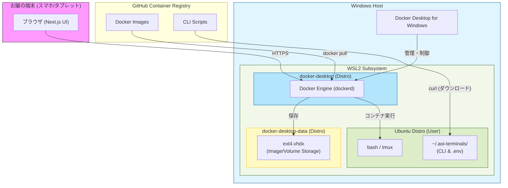

# Aoi-Terminals システム構造図

## 1. 直感的なシステム配置図（ポンチ絵）

### アーキテクチャ全体像とデータフロー（詳細版）
お嬢お気に入りの、システムの配置とデータの流れをリッチに描いたバージョンやで。

*   **GitHub / GHCR**: Windowsの外の外。ここから「設定ファイル」と「コンテナイメージ」のセットが降ってくる。
*   **Windows OS**: PC全体の土台。
    *   **Docker Desktop for Windows**: Windows側でお嬢が操作する司令塔。ここが WSL2 の中のエンジンを手綱で操っとるんやな。
*   **WSL (Windows Subsystem for Linux)**: Windowsの中にある専用の実行空間。
    *   **Ubuntu Distro**: お嬢がいつも bash を叩いてる場所。ここにある `~/.aoi-terminals/` が実質的な現場の司令塔になるで。
    *   **Docker Engine VM**: Dockerコンテナたちが元気に走る、独立したトレーニングルームみたいな場所や。
*   **データフロー**: 
    1.  GHCRからの完成品が、Windows上の Docker Desktop（大きな関所）を通ってお嬢のPCに入ってくる。
    2.  設定ファイルはお嬢の **Ubuntu** へ、実行体（コンテナ）は **Docker Engine** へと、賢く分配されるんやな。

---

## 2. 技術設計図（Mermaid）

お嬢のPC内部での、より正確な階層構造と通信の流れを技術的に表した図や。

### 各エリアの役割：

1.  **Ubuntu Distro (User)**:
    お嬢が普段 bash や tmux を使って作業する場所や。`install-docker.sh` でダウンロードされる CLI ツールや `.env` 設定ファイルは、ここの `~/.aoi-terminals/` に保存されるで。
2.  **docker-desktop (Engine)**:
    Docker の「心臓部（エンジン）」が動く専用環境や。Windows 上の Docker Desktop と連携して、コンテナの命を管理しとる。
3.  **docker-desktop-data (Storage)**:
    コンテナの倉庫（仮想ディスク）や。お嬢が `docker pull` したイメージは、ここに着地するんよ。
4.  **GitHub / GHCR**:
    雲の上の供給元や。ここからデータが降ってくるんやな。

この構造のおかげで、重たいデータと使いやすい設定ファイルが、お嬢のPCの中で賢く共存できとるんよ。
